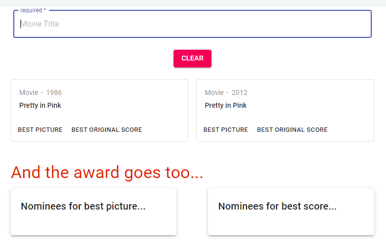

# OMDB Shoppies


OMDB Shoppies is the movie awards your way with the ability to search for a movie and nominate movies for best picture or 
best original score.


## Description 


This project was created as a quick serverless React Application:

* Designed with Material UI -- employing a flexbox grid for a responsive layout.
* It makes use of localStorage to preserve the User's activities.
* Axios was used to access OMDB API in retrieval of the movie search results. 
* The React app was built utilizing all function components with hooks.
* Deployment through Netlify which focuses on serverless react deploys.
* Simplistic in designs but the power to manipulate many aspects within the app with ease.


## Demo 

[demo app here](https://shoppies-bt.netlify.app/)





## Technologies

* React
* Javascript
* Axios
* Material UI
* dotenv
* Netlify


## Installation 

When creating your own clone or fork repo, then proceed with:

```
npm i
```


## License

MIT License

Copyright (c) 2021 Bobbi Tarkany

Permission is hereby granted, free of charge, to any person obtaining a copy of this software and associated documentation files (the "Software"), to deal in the Software without restriction, including without limitation the rights to use, copy, modify, merge, publish, distribute, sublicense, and/or sell copies of the Software, and to permit persons to whom the Software is furnished to do so, subject to the following conditions:

The above copyright notice and this permission notice shall be included in all copies or substantial portions of the Software.

THE SOFTWARE IS PROVIDED "AS IS", WITHOUT WARRANTY OF ANY KIND, EXPRESS OR IMPLIED, INCLUDING BUT NOT LIMITED TO THE WARRANTIES OF MERCHANTABILITY, FITNESS FOR A PARTICULAR PURPOSE AND NONINFRINGEMENT. IN NO EVENT SHALL THE AUTHORS OR COPYRIGHT HOLDERS BE LIABLE FOR ANY CLAIM, DAMAGES OR OTHER LIABILITY, WHETHER IN AN ACTION OF CONTRACT, TORT OR OTHERWISE, ARISING FROM, OUT OF OR IN CONNECTION WITH THE SOFTWARE OR THE USE OR OTHER DEALINGS IN THE SOFTWARE.


